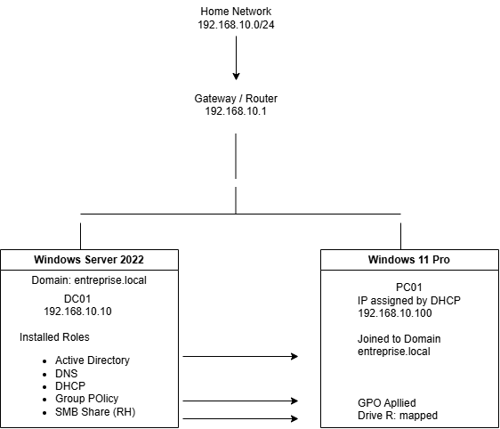
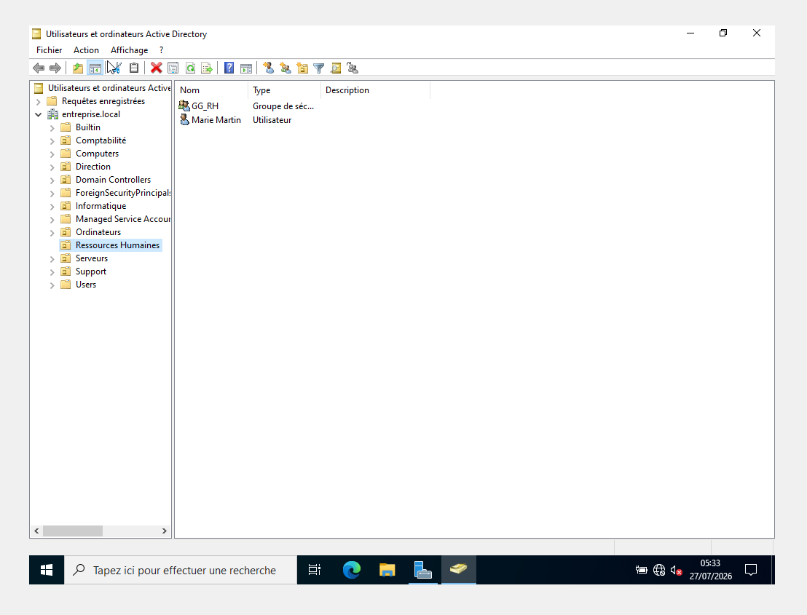
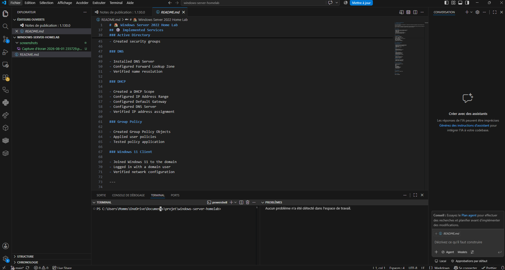
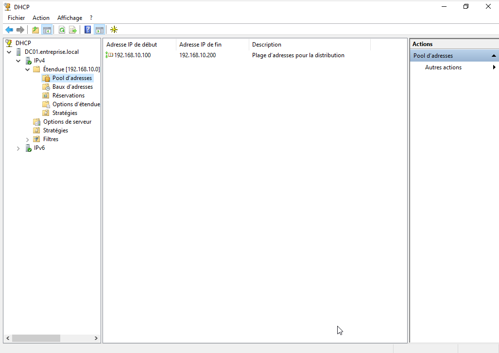
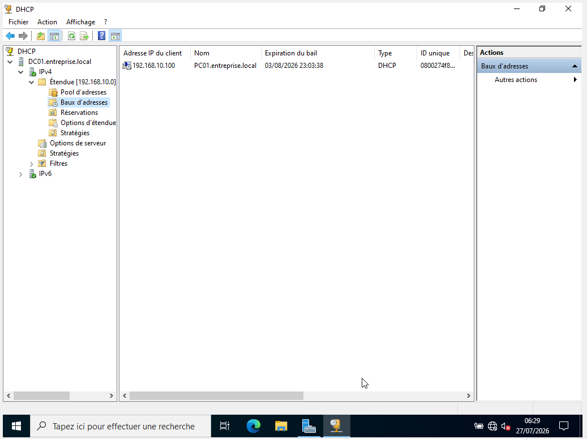
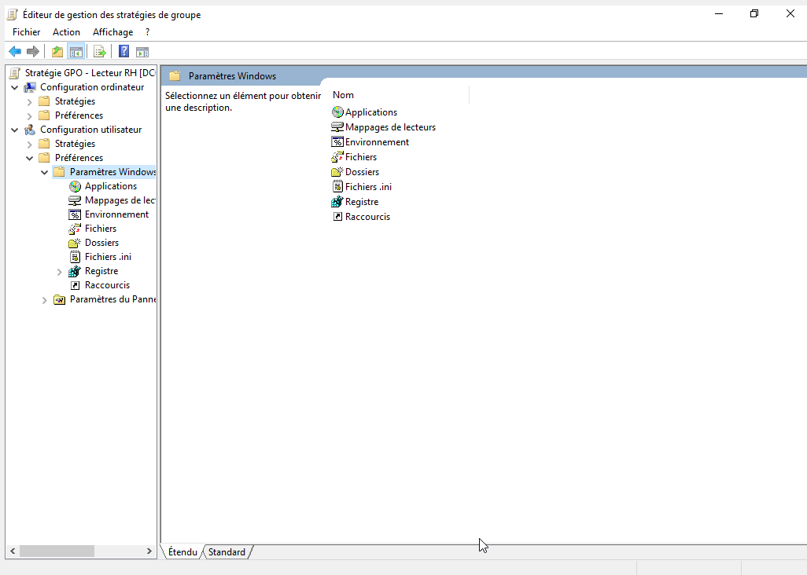
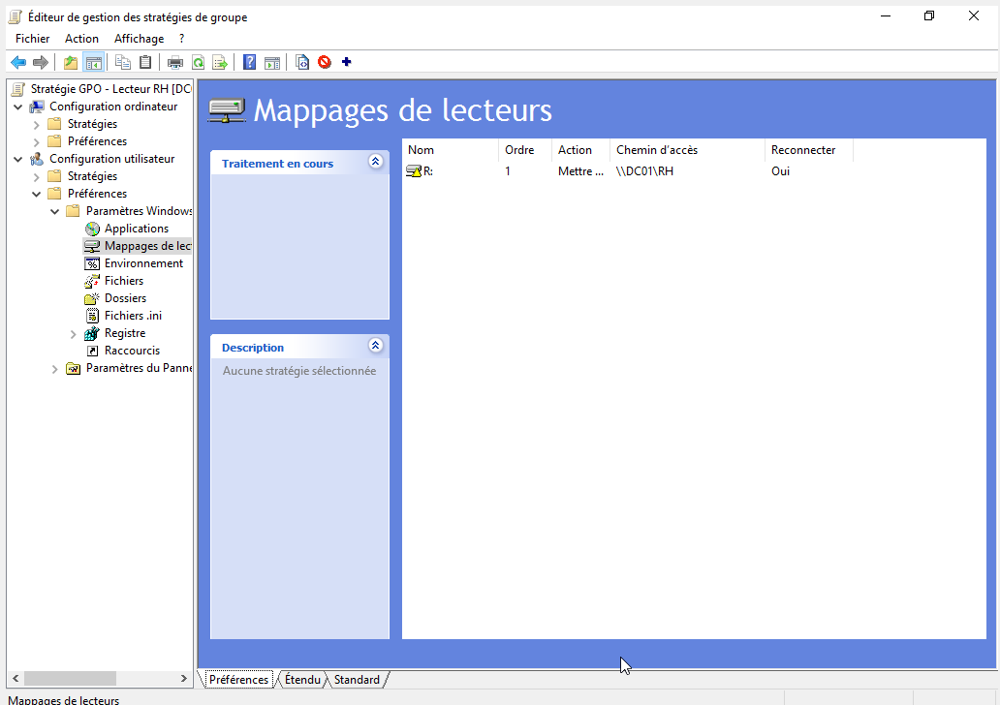
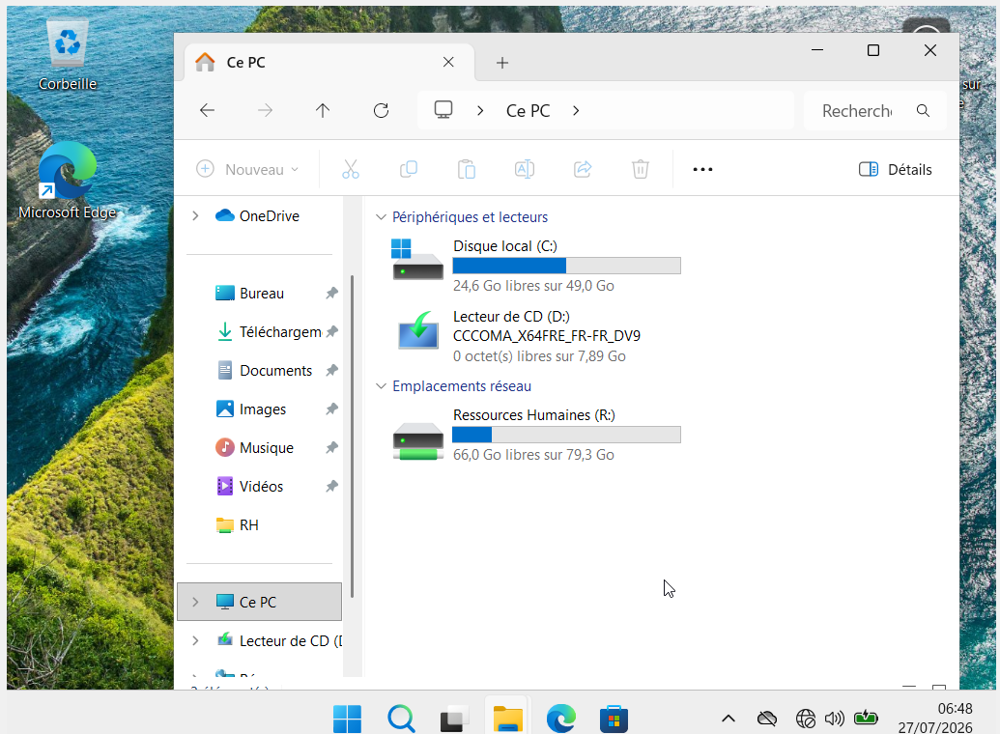
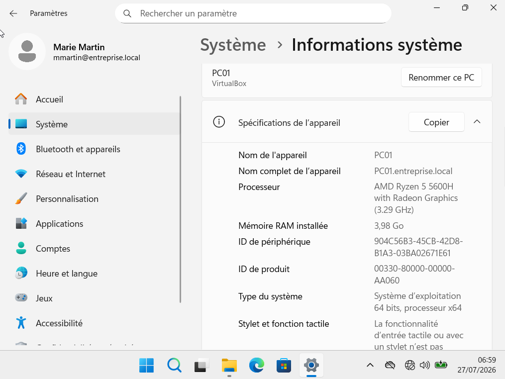
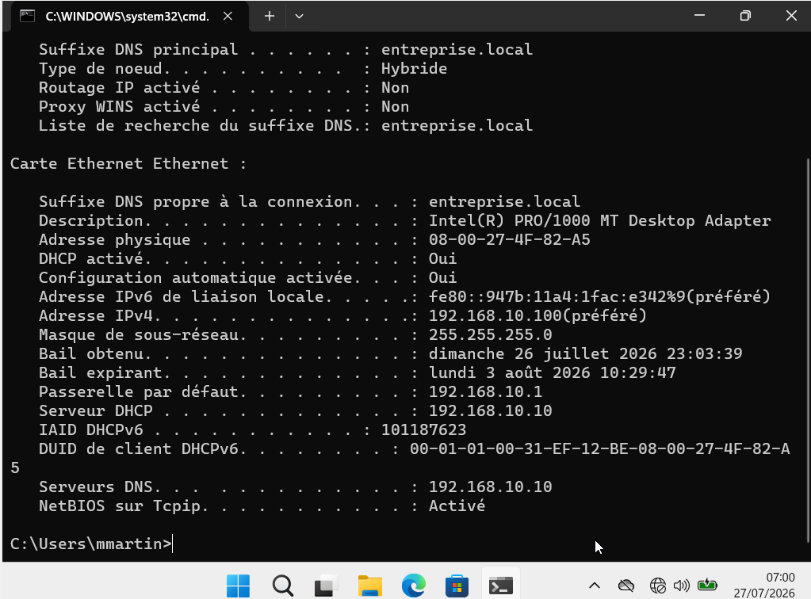

# 🏠 Windows Server 2022 Home Lab

## 📖 Project Overview

This project demonstrates the deployment of a Windows Server 2022 Home Lab designed to practice Windows Server administration in a small enterprise environment.

The lab includes the installation and configuration of Active Directory Domain Services (AD DS), DNS, DHCP and Group Policy. A Windows 11 client was joined to the domain to simulate a real corporate environment.

---
## Architecture

### Infrastructure

- Windows Server 2022 (DC01)
- Active Directory Domain Services
- DNS Server
- DHCP Server
- Group Policy Objects (GPO)
- SMB Shared Folder (RH)
- Windows 11 Domain Client (PC01)

## 🎯 Objectives

- Deploy a Windows Server 2022 Domain Controller
- Configure Active Directory Domain Services
- Configure DNS
- Configure DHCP
- Create users and security groups
- Join a Windows 11 client to the domain
- Apply Group Policy Objects (GPO)

---

## 🖥️ Environment

| Component | Technology |
|-----------|------------|
| Server | Windows Server 2022 |
| Client | Windows 11 |
| Directory Service | Active Directory |
| DNS | Windows DNS |
| DHCP | Windows DHCP |
| Policies | Group Policy |
| Virtualization | VirtualBox |

---

## ⚙️ Implemented Services

### Active Directory
The server was promoted to a Domain Controller and configured with Active Directory Domain Services.

Implemented features:

- Installed Active Directory Domain Services
- Promoted the server as a Domain Controller
- Created Organizational Units (OU)
- Created users
- Created security groups

#### Screenshot

### DNS

Configured the DNS Server role to provide name resolution for the Active Directory domain.

Implemented:

- Installed DNS Server
- Configured Forward Lookup Zone
- Verified name resolution

#### Screenshot

### DHCP

Configured the DHCP Server role to automatically assign IP addresses to domain clients.

Implemented:

- Created a DHCP Scope
- Configured IP Address Range
- Configured Default Gateway
- Configured DNS Server
- Verified IP address assignment

#### Screenshot

#### DHCP Scope

#### Active Lease

The Windows 11 client (PC01) successfully received its IP address automatically from the DHCP server.

### Group Policy

Configured and deployed Group Policy Objects to manage user settings.

Implemented:

- Linked a custom GPO to the Human Resources OU
- Configured a mapped network drive (R:)
- Automatically deployed the shared drive to domain users

#### Screenshots

### Windows 11 Client

Joined a Windows 11 workstation to the Active Directory domain and verified network connectivity.

Verified:

- Successful domain join
- Domain user authentication
- DNS resolution
- DHCP IP assignment
- Group Policy application
- Network drive deployment (R:)

#### Screenshots

## 📚 Skills Demonstrated

- Windows Server Administration
- Active Directory
- DNS
- DHCP
- Group Policy
- User Management
- Domain Administration
- Windows Networking
- Troubleshooting

---

## Project Structure

screenshots/
 README.md

## Conclusion

This project demonstrates the deployment of a small Windows Server infrastructure including Active Directory, DNS, DHCP, Group Policy and a Windows 11 domain client.

The objective was to reproduce a typical enterprise environment and practice common System Administration and IT Support tasks.

---

## Skills Demonstrated

## Skills Demonstrated

- Windows Server 2022 Administration
- Active Directory Domain Services (AD DS)
- DNS Configuration
- DHCP Configuration
- Organizational Units (OU)
- User & Group Management
- Group Policy Objects (GPO)
- SMB File Sharing
- Windows 11 Domain Join
- Drive Mapping via GPO
- Network Troubleshooting
- Infrastructure Documentation

---

## 👨‍💻 Author

Mommsen ILANSEGARIN
